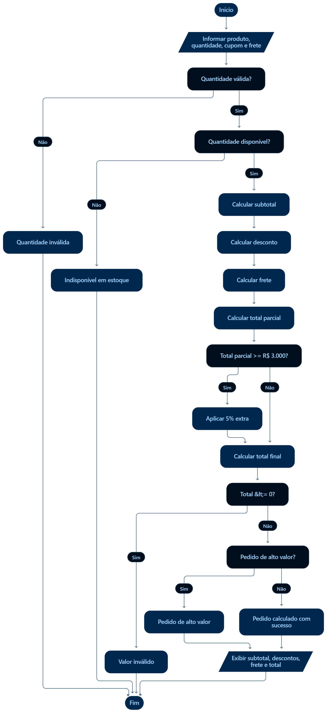

# Teste de Caixa Branca
Instituição: SENAI
Curso: Técnico de Desenvolvimento de Sistemas
Unidade Curricular: SESI CE-356
Atividade: Teste de Caixa Branca
Aluno: Miguel Araujo Gerbi
Turma: 3A
Professores: Robson Bacchin, Reenye Lima e Wellington Fábio
Data: 02/10/2026

## 1. Contextualização

No teste de caixa branca, a estrutura interna do código é analisada para verificar o fluxo de controle e exercitar suas condições e ramificações.

Essa abordagem permite identificar falhas associadas a cenários específicos, especialmente nos valores-limite das regras de negócio.

**Sistema analisado:** página de cálculo de pedidos em que o usuário seleciona um produto, informa a quantidade, pode aplicar um cupom e escolhe a modalidade de frete.

Ao acionar **“Calcular pedido”**, o sistema exibe:

- Subtotal;
- Descontos;
- Frete;
- Total;
- Mensagem do pedido.

A lógica de processamento está implementada em `script.js`.

## 2. Comportamento Esperado

| Regra | Comportamento esperado |
|---|---|
| Quantidade | Deve ser um número inteiro maior que zero. |
| Estoque | A quantidade solicitada pode ser igual ao estoque disponível, inclusive. |
| Cupom SENAI10 | Aplica 10% de desconto sobre o subtotal. |
| Cupom SENAI20 | Aplica 20% de desconto quando o subtotal é igual ou superior a R$ 1.000. |
| Desconto por quantidade | Aplica 5% de desconto sobre o subtotal a partir de 5 unidades. |
| Retirada | Frete gratuito. |
| Expresso | Frete de R$ 60. |
| Normal | Frete de R$ 30, gratuito para subtotal igual ou superior a R$ 500. |
| Alto valor | Aplica 5% adicional quando o total parcial é igual ou superior a R$ 3.000. |
| Exibição | O total deve corresponder ao subtotal menos os descontos, acrescido do frete. |

## 3. Estruturas de Decisão

O código utiliza estruturas condicionais `if` para controlar os fluxos de execução conforme as regras de negócio.

| ID | Onde | Condição | Ramificações |
|---|---|---|---|
| D1 | `calcularDesconto` | `codigo === "SENAI10"` | Aplica 10% / prossegue sem esse desconto |
| D2 | `calcularDesconto` | `codigo === "SENAI20" && subtotal >= 1000` | Aplica 20% / prossegue sem esse desconto |
| D3 | `calcularFrete` | `tipo === "retirada"` | Retorna R$ 0 / avalia as demais modalidades |
| D4 | `calcularFrete` | `tipo === "expresso"` | Retorna R$ 60 / avalia as demais modalidades |
| D5 | `calcularFrete` | `subtotal >= 500` | Retorna R$ 0 / retorna R$ 30 |
| D6 | `finalizarPedido` | Quantidade inválida | Exibe erro / prossegue com o processamento |
| D7 | `finalizarPedido` | `qtd > estoque` | Exibe indisponibilidade / prossegue com o cálculo |
| D8 | `finalizarPedido` | `qtd >= 5` | Aplica 5% / não aplica o desconto por quantidade |
| D9 | `finalizarPedido` | `totalParcial >= 3000` | Aplica 5% adicional / não aplica |
| D10 | `finalizarPedido` | `total <= 0` | Exibe valor inválido / prossegue |
| D11 | `finalizarPedido` | `altoValor` | Exibe mensagem de alto valor / exibe mensagem de sucesso |

## 4. Fluxogramas do Sistema

### 4.1 Fluxograma geral

  

### 4.2 Fluxograma — Cálculo do desconto

  

### 4.3 Fluxograma — Desconto por quantidade

  

### 4.4 Fluxograma — Cálculo do frete

  

### 4.5 Fluxograma — Validação da quantidade

  

### 4.6 Fluxograma — Cálculo do total

  

### 4.7 Fluxograma — Pedido de alto valor

  

### 4.8 Fluxograma — Fluxo completo de execução

  

## 5. Erros

| Teste | Entrada | Resultado Esperado | Resultado Obtido |
|---|---|---|---|
| CT01 | Mouse, 0, sem cupom, normal | Quantidade inválida | "Pedido calculado com sucesso", total R$ 30,00 |
| CT02 | Teclado, 10, sem cupom, retirada | Aceito, total R$ 1.425,00 | "Quantidade indisponível em estoque" |
| CT03 | Mouse, 5, sem cupom, retirada | Total R$ 380,00 | Total R$ 400,00, sem desconto |
| CT04 | Mouse, 10, SENAI10, retirada | Desconto R$ 120,00, total R$ 680,00 | Desconto R$ 80,00, total R$ 680,00 |
| CT05 | Notebook, 1, sem cupom, retirada | Total R$ 2.850,00 e alto valor | Total R$ 3.000,00 e "alto valor" |
| CT06 | Notebook, 1, sem cupom, expresso | Alto valor, total R$ 2.907,00 | "Pedido calculado com sucesso", total R$ 2.907,00 |
